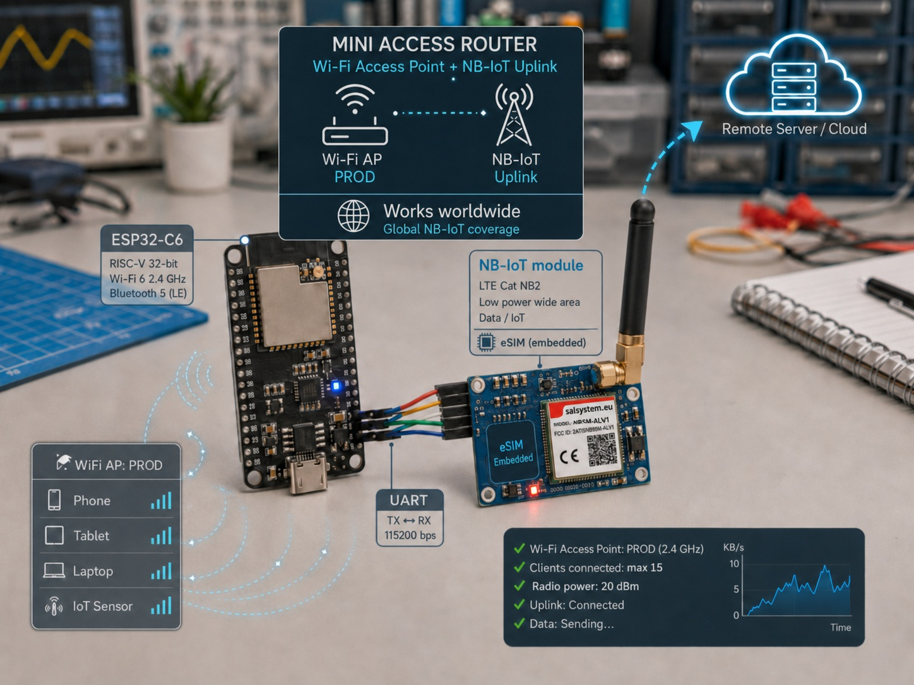

# Mini Access Router ESP32-C6 + NB-IoT



## Opis projektu

Projekt przedstawia miniaturowy router dostępowy zbudowany z dwóch współpracujących modułów:

- **ESP32-C6** pracującego jako punkt dostępowy Wi-Fi, Zigbee, BT
- **modułu NB-IoT** z wbudowaną kartą **eSIM**,
- połączenia UART pomiędzy ESP32-C6 i modułem NB-IoT,
- kolejki danych opartej na FreeRTOS,
- mechanizmu przekazywania danych telemetrycznych do zdalnego serwera.

ESP32-C6 rozgłasza lokalną bezpeiczną sieć Wi-Fi:

```text
SSID: PROD
```

Urządzenia podłączone do sieci `PROD` wysyłają dane telemetryczne przez HTTP do ESP32-C6. ESP32-C6 przechwytuje zapytanie, zapisuje je w kolejce FIFO, a następnie osobny task wysyła je przez UART do modułu NB-IoT.

Moduł NB-IoT realizuje transmisję danych do serwera zewnętrznego.

> Globalna praca urządzenia zależy od dostępności sieci NB-IoT, roamingu oraz konfiguracji operatora eSIM.

---

## Najważniejsze funkcje

- Access Point Wi-Fi `PROD`,
- adres bramy `192.168.50.1`,
- obsługa wielu urządzeń ESP32,
- maksymalnie do 15 klientów Wi-Fi,
- ustawienie mocy nadajnika Wi-Fi do 20 dBm,
- lokalny serwer HTTP,
- lokalny serwer DNS,
- przechwytywanie zapytań kończących się na `set.php`,
- podmiana lokalnego adresu IP na docelowy adres serwera,
- kolejka FIFO oparta na FreeRTOS,
- wysyłanie jednego wpisu przez UART co 5 sekund,
- usuwanie wpisu z kolejki po zakończeniu transmisji UART,
- komunikacja UART 115200 bps,
- watchdog 60 sekund,
- moduł NB-IoT z wbudowaną kartą eSIM,
- przesyłanie danych telemetrycznych do zdalnego API,
- endpoint statusu urządzenia,
- opcjonalne dane systemowe: `IMSI`, `KEY`, `IP`,
- opcjonalna strefa czasowa `timezone`.

---

## Architektura systemu

```text
Urządzenie nr 1 ─┐
Urządzenie nr 2 ─┤
Urządzenie nr 3 ─┤ Wi-Fi PROD
...                     ├──────────────► ESP32-C6 Access Point
Urządzenie nr 15 ─┘                    192.168.50.1
                                                  │
                                                  │ kolejka FreeRTOS
                                                  ▼
                                          UART 115200 bps
                                                  │
                                                  ▼
                                         Moduł NB-IoT z eSIM
                                                  │
                                                  │ NB-IoT
                                                  ▼
                                         Zdalny serwer / API
```

---

## Struktura repozytorium

```text
.
├── main.ino
├── SALGSMv1.cpp
├── SALGSMv1.h
├── image.jpg
└── README.md
```

Plik `image.jpg` powinien znajdować się w tym samym katalogu co:

```text
main.ino
README.md
```


---

# ESP32-C6 – Access Point PROD

## Konfiguracja sieci

Przykładowa konfiguracja:

```cpp
const char *AP_SSID = "PROD";
const char *AP_PASSWORD = "PROD-2026";

const uint8_t AP_MAX_CLIENTS = 15;

IPAddress AP_IP(192, 168, 50, 1);
IPAddress AP_GATEWAY(192, 168, 50, 1);
IPAddress AP_SUBNET(255, 255, 255, 0);
```

Uruchomienie Access Pointa:

```cpp
WiFi.mode(WIFI_AP);

WiFi.softAPConfig(
    AP_IP,
    AP_GATEWAY,
    AP_SUBNET
);

WiFi.softAP(
    AP_SSID,
    AP_PASSWORD,
    1,
    0,
    AP_MAX_CLIENTS
);
```

---

## Moc nadajnika Wi-Fi

Do programu należy dodać:

```cpp
#include "esp_wifi.h"
```

Po uruchomieniu `WiFi.softAP()` można ustawić maksymalną moc nadajnika:

```cpp
esp_wifi_set_max_tx_power(80);
```

Wartość `80` odpowiada:

```text
80 × 0,25 dBm = 20 dBm
```

Odczyt ustawionej mocy:

```cpp
int8_t currentTxPower = 0;

if (esp_wifi_get_max_tx_power(&currentTxPower) == ESP_OK)
{
    Serial.print("Moc TX: ");
    Serial.print(currentTxPower / 4.0);
    Serial.println(" dBm");
}
```

Wartość `84` nie wymusza stałych 21 dBm. W praktyce sterownik mapuje najwyższe ustawienia do maksymalnego dostępnego poziomu dla danego trybu radiowego.

---

# Lokalny serwer DNS

ESP32-C6 może kierować nazwy domenowe klientów na swój lokalny adres IP:

```cpp
DNSServer dnsServer;

dnsServer.start(
    53,
    "*",
    AP_IP
);
```

W `loop()`:

```cpp
dnsServer.processNextRequest();
```

Dzięki temu urządzenie podłączone do sieci `PROD` może wysłać zapytanie np.:

```text
http://moj-serwer/api/tlm/v1/set.php?ID=1234&value=23&description=temperatura&unit=stC
```

a lokalny DNS może skierować nazwę serwera na:

```text
192.168.50.1
```

---

# Odbieranie zapytań HTTP

ESP32-C6 obsługuje lokalne endpointy:

```text
/set.php
/api/set.php
/api/tlm/v1/set.php
```

Można też przechwycić każdą ścieżkę kończącą się na:

```text
/set.php
```

Przykład:

```cpp
void handleNotFound()
{
    if (server.uri().endsWith("/set.php"))
    {
        handleSetRequest();
        return;
    }

    sendJsonError(
        404,
        String("Nieznany adres: ") + server.uri()
    );
}
```

---

# Docelowy adres serwera

ESP32-C6 może podmienić lokalny adres IP na właściwy adres serwera.

Przykład wejściowy:

```text
http://192.168.50.1/api/tlm/v2/set.php?ID=1234&value=23&description=temperatura&unit=stC
```

Przykład wysyłany przez UART:

```text
https://dlb.com.pl/api/tlm/v2/set.php?ID=1234&value=23&description=temperatura&unit=stC
```

Konfiguracja stałego adresu:

```cpp
const char *TARGET_SET_URL =
    "https://dlb.com.pl/api/tlm/v2/set.php";
```

Budowanie adresu:

```cpp
String buildQueuedRequest()
{
    String request = TARGET_SET_URL;

    if (server.args() > 0)
    {
        request += '?';
    }

    for (int i = 0; i < server.args(); i++)
    {
        if (i > 0)
        {
            request += '&';
        }

        request += urlEncode(server.argName(i));
        request += '=';
        request += urlEncode(server.arg(i));
    }

    return request;
}
```

---

# Parametry telemetryczne

## Parametry podstawowe

| Parametr | Wymagany | Opis | Przykład |
|---|---:|---|---|
| `ID` | tak | identyfikator urządzenia | `1234` |
| `value` | tak | wartość pomiarowa | `23` |
| `description` | tak | nazwa charakterystyki | `temperatura` |
| `unit` | tak | jednostka | `stC` |
| `timezone` | nie | strefa czasowa | `Europe/Warsaw` |

## Dane systemowe

| Parametr | Wymagany | Opis | Przykład |
|---|---:|---|---|
| `IMSI` | nie | numer IMSI modułu NB-IoT | `901405180011354` |
| `KEY` | nie | klucz urządzenia | `999` |
| `IP` | nie | adres IP uzyskany przez moduł | `10.0.0.5` |

---

## Przykład podstawowego zapytania

```text
http://192.168.50.1/api/tlm/v2/set.php?ID=1234&value=23&description=temperatura&unit=stC
```

## Przykład ze strefą czasową

```text
http://192.168.50.1/api/tlm/v2/set.php?ID=1234&value=23&description=temperatura&unit=stC&timezone=Europe%2FWarsaw
```

Znak `/` w nazwie strefy czasowej jest kodowany jako:

```text
%2F
```

Przykłady:

```text
Europe/Warsaw  -> Europe%2FWarsaw
Europe/London  -> Europe%2FLondon
America/New_York -> America%2FNew_York
```

## Przykład z danymi systemowymi

```text
http://192.168.50.1/api/tlm/v2/set.php?ID=1234&value=23&description=temperatura&unit=stC&timezone=Europe%2FWarsaw&IMSI=901405180011354&KEY=999&IP=10.0.0.5
```

---

# Kolejka FreeRTOS

Każde poprawne zapytanie HTTP jest zapisywane do kolejki FIFO.

Konfiguracja:

```cpp
#define TELEMETRY_QUEUE_SIZE 50
#define TELEMETRY_MESSAGE_SIZE 512
#define UART_SEND_INTERVAL_MS 30000
```

Struktura wiadomości:

```cpp
struct TelemetryMessage
{
    char request[TELEMETRY_MESSAGE_SIZE];
};
```

Uchwyt kolejki:

```cpp
QueueHandle_t telemetryQueue = NULL;
```

Utworzenie kolejki:

```cpp
telemetryQueue = xQueueCreate(
    TELEMETRY_QUEUE_SIZE,
    sizeof(TelemetryMessage)
);
```

---

## Dodawanie zapytania do kolejki

```cpp
TelemetryMessage message;

memset(
    &message,
    0,
    sizeof(message)
);

request.toCharArray(
    message.request,
    sizeof(message.request)
);

BaseType_t queueResult = xQueueSend(
    telemetryQueue,
    &message,
    0
);
```

Jeżeli kolejka jest pełna, serwer zwraca:

```json
{
  "status": "error",
  "message": "Kolejka jest pelna"
}
```

Zalecany kod HTTP:

```text
503 Service Unavailable
```

---

## Odpowiedź po dodaniu do kolejki

Zalecany kod HTTP:

```text
202 Accepted
```

Przykładowa odpowiedź:

```json
{
  "status": "queued",
  "message": "Dane dodane do kolejki",
  "queue_count": 1,
  "queue_free": 49,
  "request": "https://dlb.com.pl/api/tlm/v1/set.php?ID=1234&value=23&description=temperatura&unit=stC"
}
```

---

# UART

## Parametry transmisji

```text
Prędkość: 115200 bps
Format: 8N1
```

Przykładowa konfiguracja:

```cpp
const int UART_RX_PIN = 4;
const int UART_TX_PIN = 5;

HardwareSerial TelemetryUART(1);

TelemetryUART.begin(
    115200,
    SERIAL_8N1,
    UART_RX_PIN,
    UART_TX_PIN
);
```

ESP32-C6 nie ma na stałe przypisanych pinów UART1. Piny RX i TX są przypisywane programowo.

Połączenie:

```text
ESP32-C6 TX  ─────► RX modułu NB-IoT
ESP32-C6 RX  ◄───── TX modułu NB-IoT
ESP32-C6 GND ────── GND modułu NB-IoT
```

> ESP32-C6 pracuje z logiką 3,3 V. Nie należy podłączać bezpośrednio sygnałów UART 5 V ani RS-232.

---

# Task wysyłający przez UART

Osobny task FreeRTOS:

1. budzi się co 30 sekund,
2. odczytuje pierwszy wpis przez `xQueuePeek()`,
3. wysyła link przez UART,
4. czeka na opróżnienie bufora przez `TelemetryUART.flush()`,
5. usuwa wpis za pomocą `xQueueReceive()`.

Schemat:

```text
kolejka FIFO
     │
     │ xQueuePeek()
     ▼
wysłanie UART
     │
     │ TelemetryUART.flush()
     ▼
xQueueReceive()
     │
     ▼
usunięcie wpisu
```

Przykładowy fragment:

```cpp
BaseType_t peekResult = xQueuePeek(
    telemetryQueue,
    &message,
    0
);

if (peekResult == pdTRUE)
{
    size_t messageLength = strlen(message.request);

    size_t writtenBytes = TelemetryUART.write(
        reinterpret_cast<const uint8_t *>(message.request),
        messageLength
    );

    size_t newlineWritten = TelemetryUART.write('\n');

    TelemetryUART.flush();

    if (
        writtenBytes == messageLength &&
        newlineWritten == 1
    )
    {
        xQueueReceive(
            telemetryQueue,
            &removedMessage,
            0
        );
    }
}
```

## Ważna informacja

`TelemetryUART.flush()` potwierdza opróżnienie bufora nadajnika UART, ale nie potwierdza, że moduł NB-IoT poprawnie przetworzył wiadomość.

Dla pełnej niezawodności moduł NB-IoT powinien odpowiedzieć:

```text
ACK
```

Wtedy wpis powinien zostać usunięty z kolejki dopiero po odebraniu potwierdzenia.

---

# Watchdog

Program używa Task Watchdog Timer.

Konfiguracja:

```cpp
#define WATCHDOG_TIMEOUT_MS 60000
```

Timeout wynosi:

```text
60 sekund
```

Do programu należy dodać:

```cpp
#include "esp_task_wdt.h"
```

Przykładowa konfiguracja:

```cpp
void initializeWatchdog()
{
    esp_task_wdt_config_t watchdogConfig = {};

    watchdogConfig.timeout_ms = WATCHDOG_TIMEOUT_MS;
    watchdogConfig.idle_core_mask = 0;
    watchdogConfig.trigger_panic = true;

    esp_err_t result =
        esp_task_wdt_init(&watchdogConfig);

    if (result == ESP_ERR_INVALID_STATE)
    {
        result =
            esp_task_wdt_reconfigure(&watchdogConfig);
    }

    if (result == ESP_OK)
    {
        Serial.println(
            "Watchdog ustawiony na 60 sekund"
        );
    }

    if (esp_task_wdt_status(NULL) != ESP_OK)
    {
        esp_task_wdt_add(NULL);
    }
}
```

Odświeżanie w `loop()`:

```cpp
void loop()
{
    esp_task_wdt_reset();

    dnsServer.processNextRequest();
    server.handleClient();

    esp_task_wdt_reset();

    delay(2);
}
```

Odświeżanie w tasku UART:

```cpp
esp_task_wdt_add(NULL);

while (true)
{
    esp_task_wdt_reset();

    vTaskDelay(
        pdMS_TO_TICKS(5000)
    );

    esp_task_wdt_reset();

    // obsługa kolejki i UART
}
```

Jeżeli monitorowany task nie odświeży watchdoga przez 60 sekund, ESP32-C6 zostanie zresetowany.

---

# Endpoint statusu

Stan urządzenia można odczytać przez:

```text
http://192.168.50.1/status
```

Przykładowa odpowiedź:

```json
{
  "gateway": "PROD",
  "status": "ok",
  "ap_ip": "192.168.50.1",
  "connected_clients": 4,
  "queue_count": 3,
  "queue_free": 47,
  "queue_capacity": 50,
  "uart_baud": 115200,
  "send_interval_ms": 5000
}
```

---

# Moduł NB-IoT

Moduł NB-IoT powinien obsługiwać:

- UART,
- transmisję HTTP lub HTTPS,
- LTE Cat NB1 lub NB2,
- wbudowaną kartę eSIM,
- odczyt IMSI,
- odczyt adresu IP,
- odczyt jakości sygnału,
- mechanizm ponownego połączenia,
- wysyłanie danych do zdalnego serwera.

Moduł nie posiada fizycznego gniazda SIM. Dane operatora są przechowywane w eSIM.

---

# Zapis danych po stronie serwera

Przykładowy endpoint:

```text
https://dlb.com.pl/api/tlm/v2/set.php
```

Przykładowe pełne zapytanie:

```text
https://dlb.com.pl/api/tlm/v2/set.php?ID=1234&value=23&description=temperatura&unit=stC&timezone=Europe%2FWarsaw&IMSI=901405180011354&KEY=999&IP=10.0.0.5
```

Przykładowy zapis JSON:

```json
{
  "ID": "1234",
  "created_at": "2026-07-15T10:20:00+02:00",
  "updated_at": "2026-07-15T10:20:00+02:00",
  "system_data": {
    "IMSI": "901405180011354",
    "KEY": "999",
    "IP": "10.0.0.5",
    "updated_at": "2026-07-15T10:20:00+02:00",
    "timezone": "Europe/Warsaw"
  },
  "measurements": {
    "temperatura": [
      {
        "timestamp": "2026-07-15T10:20:00+02:00",
        "timestamp_unix": 1784103600,
        "timezone": "Europe/Warsaw",
        "value": 23,
        "unit": "stC"
      }
    ]
  }
}
```

---

# Bezpieczeństwo

Zalecenia:

- używać HTTPS,
- nie przesyłać kluczy przez nieszyfrowany HTTP,
- unikać przechowywania kluczy w kodzie źródłowym,
- walidować parametry `ID`, `value`, `description`, `unit`,
- ograniczyć długość linku,
- ograniczyć liczbę elementów w kolejce,
- zabezpieczyć Access Point silnym hasłem,
- stosować mechanizm ponawiania transmisji,
- dodać potwierdzenie `ACK`,
- przy długiej awarii zapisywać kolejkę w LittleFS lub NVS,
- nie traktować samego `KEY` w adresie URL jako pełnego zabezpieczenia.

---

# Wymagane biblioteki

```cpp
#include <WiFi.h>
#include <WebServer.h>
#include <DNSServer.h>
#include <HardwareSerial.h>

#include "esp_wifi.h"
#include "esp_task_wdt.h"

#include "freertos/FreeRTOS.h"
#include "freertos/queue.h"
#include "freertos/task.h"
```

---

# Wymagania sprzętowe

- ESP32-C6,
- moduł NB-IoT,
- aktywna eSIM,
- antena NB-IoT,
- wspólna masa pomiędzy modułami,
- stabilne zasilanie,
- przewody UART,
- dostęp do sieci NB-IoT operatora.

---

# Uruchomienie

1. Otwórz projekt w Visual.
2. Wybierz właściwą płytkę ESP32-C6.
3. Ustaw właściwe piny UART.
4. Ustaw SSID i hasło sieci `PROD`.
5. Ustaw docelowy adres `TARGET_SET_URL`.
6. Wgraj program do ESP32-C6.
7. Połącz urządzenie klienckie z siecią `PROD`.
8. Wyślij testowe zapytanie HTTP.
9. Sprawdź odpowiedź `202 Accepted`.
10. Sprawdź transmisję UART.
11. Sprawdź status pod `/status`.

---

# Test

Połącz urządzenie z siecią:

```text
SSID: PROD
Hasło: PROD_telemetry_2026
```

Wyślij:

```text
http://192.168.50.1/api/tlm/v2/set.php?ID=1234&value=23&description=temperatura&unit=stC&timezone=Europe%2FWarsaw
```

Oczekiwana odpowiedź:

```json
{
  "status": "queued",
  "message": "Dane dodane do kolejki",
  "queue_count": 1,
  "queue_free": 49
}
```

Po maksymalnie 5 sekundach link powinien zostać wysłany przez UART do modułu NB-IoT.

---

# Możliwe dalsze rozszerzenia

- potwierdzenie `ACK`,
- licznik prób retransmisji,
- zapis kolejki w LittleFS,
- panel konfiguracyjny WWW,
- konfiguracja APN przez stronę WWW,
- konfiguracja serwera docelowego bez rekompilacji,
- OTA,
- podpisywanie firmware,
- Secure Boot,
- szyfrowanie Flash,
- dodatkowa diagnostyka RSSI,
- historia błędów NB-IoT,
- statystyki wysłanych danych,
- automatyczny restart modułu NB-IoT,
- wieloserwerowy fallback,
- synchronizacja czasu z serwera,
- obsługa POST i JSON.

---

## Autor

**Dawid Rosak**
